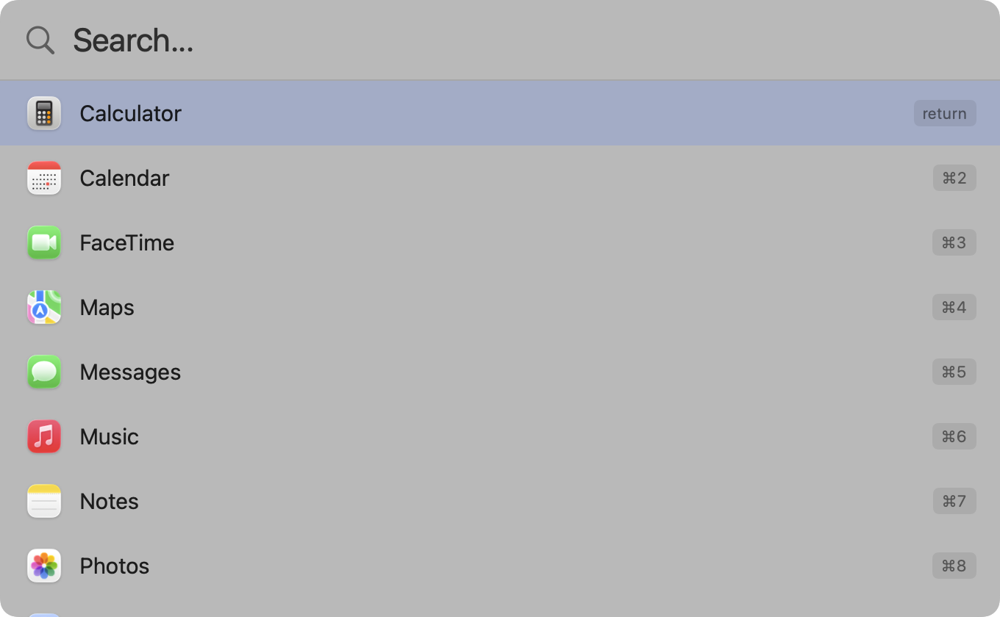

<div align="center">

# Occam

**The simplest way to launch apps on macOS.**

One shortcut. Instant results. No bloat.



[](https://github.com/mpalczew/occam/actions/workflows/ci.yml)
[](#requirements)
[](LICENSE)
[](https://github.com/mpalczew/occam/releases/latest)

</div>

---

## Why Occam?

- **Fast** -- Scans ~200 apps in ~50ms. No background indexing, no persistent processes chewing CPU.
- **Private** -- Zero network calls. Zero telemetry. Your data stays on your Mac.
- **Tiny** -- ~800 lines of Swift. No frameworks, no dependencies, no Electron.
- **Smart** -- Fuzzy matching with recency sorting. Your most-used apps surface first.

## Install

```bash
brew tap mpalczew/occam
brew install --cask occam
```

### Other options

<details>
<summary>Download from GitHub Releases</summary>

1. Download the latest `Occam-x.x.x-universal.zip` from [Releases](https://github.com/mpalczew/occam/releases/latest)
2. Unzip and drag **Occam.app** to your Applications folder
3. Launch Occam

</details>

<details>
<summary>Build from source</summary>

```bash
git clone https://github.com/mpalczew/occam.git
cd occam
make build
cp -r .build/Occam.app /Applications/
```

Requires Xcode Command Line Tools (`xcode-select --install`).

</details>

## Usage

Press **Cmd+Space** to open Occam. Start typing to search.

| Key | Action |
|-----|--------|
| Cmd+Space | Toggle search panel |
| Type | Fuzzy search apps and settings |
| Up/Down | Navigate results |
| Enter | Launch selected |
| Cmd+1-9 | Launch by position |
| Esc | Dismiss |
| Cmd+Q | Quit Occam |

On first launch, Occam will offer to disable Spotlight's Cmd+Space shortcut (or you can switch to Option+Space).

## What it searches

- All `.app` bundles under `/Applications` and `/System/Applications` (recursive)
- 25 System Settings panes (Wi-Fi, Bluetooth, Display, Sound, Keyboard, and more)
- Built-in commands: "Quit Occam", "Restart Occam"

Results are sorted by most recently launched when the search field is empty.

<details>
<summary><strong>Architecture & Technical Details</strong></summary>

### How it works

- **No dock icon** -- Runs as a background agent (`LSUIElement = true`)
- **Borderless floating panel** -- `NSPanel` with vibrancy blur, appears near the top of screen
- **Fuzzy matching** -- Scores consecutive character runs, word-start matches, and prefix matches
- **Recency sorting** -- Launch history stored in UserDefaults
- **Global hotkey** -- Carbon `RegisterEventHotKey` (the only reliable API for global shortcuts on macOS)
- **Login item** -- Offered on first launch via `SMAppService`

No `mdfind`, no `NSMetadataQuery`, no background indexing. Fresh `FileManager` scan each time you open the panel (~50ms for ~200 apps).

### Project structure

```
Sources/Occam/
  main.swift          # NSApplication entry point
  AppDelegate.swift   # Panel management, hotkey registration, launch logic
  SearchPanel.swift   # Borderless floating NSPanel
  SearchView.swift    # SwiftUI search UI (text field + results list)
  SearchState.swift   # Observable state, recency sorting, built-in commands
  AppDiscovery.swift  # Recursive FileManager scan of /Applications
  FuzzyMatcher.swift  # Subsequence scoring algorithm
  SystemSettings.swift # System Settings pane URLs
  HotkeyConfig.swift  # Cmd+Space / Option+Space config
  RecentApps.swift    # Launch history in UserDefaults
  LaunchItem.swift    # Data model
```

Zero external dependencies. Hybrid AppKit + SwiftUI. ~800 lines total.

</details>

## Uninstall

1. Quit Occam (Cmd+Q or type "quit" in the search panel)
2. Delete Occam.app from Applications
3. Remove login item: System Settings > General > Login Items > remove Occam

## Requirements

- macOS 13 (Ventura) or later
- Apple Silicon or Intel Mac

## License

[MIT](LICENSE)
